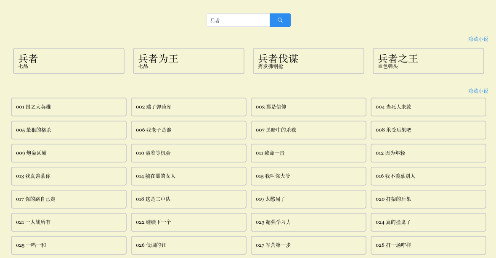

# WEB-CLIENT

## 概述

小说的 web 客户端。

## 图示

小说、目录页面



小说阅读页面


手机浏览器阅读页面


## 启动

```
$ cd client_web_spa_vues
$ npm install
$ npm run dev         # 启动工程
```

## 打包

```
$ npm run build       # 打包
```